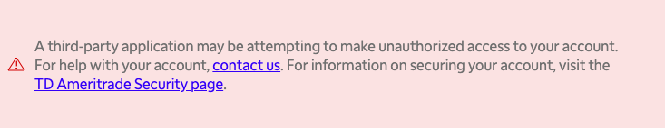

.. highlight:: python
.. py:module:: tda.auth

.. _auth:

==================================
Authentication and Client Creation
==================================

By now, you should have followed the instructions in :ref:`getting_started` and 
are ready to start making API calls. Read this page to learn how to get over the 
last remaining hurdle: OAuth authentication.

Before we begin, however, note that this guide is meant to users who want to run 
applications on their own machines, without distributing them to others. If you 
plan on distributing your app, or if you plan on running it on a server and 
allowing access to other users, this login flow is not for you.

---------------
OAuth Refresher
---------------

*This section is purely for the curious. If you already understand OAuth (wow,
congrats) or if you don't care and just want to use this package as fast as
possible, feel free to skip this section. If you encounter any weird behavior, 
this section may help you understand what's going on.*

Webapp authentication is a complex beast. The OAuth protocol was created to 
allow applications to access one anothers' APIs securely and with the minimum 
level of trust possible. A full treatise on this topic is well beyond the scope
of this guide, but in order to alleviate
`some <https://www.reddit.com/r/algotrading/comments/brohdx/
td_ameritrade_api_auth_error/>`__
`of <https://www.reddit.com/r/algotrading/comments/alk7yh/
tdameritrade_api_works/>`__
`the <https://www.reddit.com/r/algotrading/comments/914q22/
successful_access_to_td_ameritrade_api/>`__
`confusion <https://www.reddit.com/r/algotrading/comments/c81vzq/
td_ameritrade_api_access_2019_guide/>`__
`and <https://www.reddit.com/r/algotrading/comments/a588l1/
td_ameritrade_restful_api_beginner_questions/>`__
`complexity <https://www.reddit.com/r/algotrading/comments/brsnsm/
how_to_automate_td_ameritrade_api_auth_code_for/>`__
that seems to surround this part of the API, let's give a quick explanation of
how OAuth works in the context of TD Ameritrade's API.

The first thing to understand is that the OAuth webapp flow was created to allow 
client-side applications consisting of a webapp frontend and a remotely hosted 
backend to interact with a third party API. Unlike the `backend application flow
<https://requests-oauthlib.readthedocs.io/en/latest/oauth2_workflow.html
#backend-application-flow>`__, in which the remotely hosted backend has a secret 
which allows it to access the API on its own behalf, the webapp flow allows 
either the webapp frontend or the remotely host backend to access the API *on 
behalf of its users*.

If you've ever installed a GitHub, Facebook, Twitter, GMail, etc. app, you've 
seen this flow. You click on the "install" link, a login window pops up, you
enter your password, and you're presented with a page that asks whether you want 
to grant the app access to your account.

Here's what's happening under the hood. The window that pops up is the 
`authentication URL <https://developer.tdameritrade.com/content/
simple-auth-local-apps>`__, which opens a login page for the target API. The 
aim is to allow the user to input their username and password without the webapp 
frontend or the remotely hosted backend seeing it. On web browsers, this is 
accomplished using the browser's refusal to send credentials from one domain to 
another.

Once login here is successful, the API replies with a redirect to a URL that the 
remotely hosted backend controls. This is the callback URL. This redirect will 
contain a code which securely identifies the user to the API, embedded in the 
query of the request.

You might think that code is enough to access the API, and it would be if the 
API author were willing to sacrifice long-term security. The exact reasons why 
it doesn't work involve some deep security topics like robustness against replay
attacks and session duration limitation, but we'll skip them here.

This code is useful only for `fetching a token from the authentication endpoint
<https://developer.tdameritrade.com/authentication/apis/post/token-0>`__. *This 
token* is what we want: a secure secret which the client can use to access API 
endpoints, and can be refreshed over time.

If you've gotten this far and your head isn't spinning, you haven't been paying 
attention. Security-sensitive protocols can be very complicated, and you should 
**never** build your own implementation. Fortunately there exist very robust 
implementations of this flow, and ``tda-api``'s authentication module makes 
using them easy.

--------------------------------------
Fetching a Token and Creating a Client
--------------------------------------

``tda-api`` provides an easy implementation of the client-side login flow in the 
``auth`` package. It uses a `selenium 
<https://selenium-python.readthedocs.io/>`__ webdriver to open the TD Ameritrade 
authentication URL, take your login credentials, catch the post-login redirect, 
and fetch a reusable token. It returns a fully-configured :ref:`client`, ready 
to send API calls. It also handles token refreshing, and writes updated tokens 
to the token file.

These functions are webdriver-agnostic, meaning you can use whatever 
webdriver-supported browser you have available on your system. You can find 
information about available webdriver on the `Selenium documentation
<https://www.selenium.dev/documentation/en/getting_started_with_webdriver/
browsers/>`__.

.. autofunction:: tda.auth.client_from_login_flow

.. _manual_login:

If for some reason you cannot open a web browser, such as when running in a 
cloud environment, the following function will guide you through the process of 
manually creating a token by copy-pasting relevant URLs.

.. autofunction:: tda.auth.client_from_manual_flow

Once you have a token written on disk, you can reuse it without going through 
the login flow again. 

.. autofunction:: tda.auth.client_from_token_file

The following is a convenient wrapper around these two methods, calling each 
when appropriate: 

.. autofunction:: tda.auth.easy_client

If you don't want to create a client and just want to fetch a token, you can use
the ``tda-generate-token.py`` script that's installed with the library. This 
method is particularly useful if you want to create your token on one machine 
and use it on another. The script will attempt to open a web browser and perform 
the login flow. If it fails, it will fall back to the manual login flow: 

.. code-block:: bash

  # Notice we don't prefix this with "python" because this is a script that was 
  # installed by pip when you installed tda-api
  > tda-generate-token.py --help
  usage: tda-generate-token.py [-h] --token_file TOKEN_FILE --api_key API_KEY --redirect_uri REDIRECT_URI

  Fetch a new token and write it to a file

  optional arguments:
    -h, --help            show this help message and exit

  required arguments:
    --token_file TOKEN_FILE
                        Path to token file. Any existing file will be overwritten
    --api_key API_KEY
    --redirect_uri REDIRECT_URI

This script is installed by ``pip``, and will only be accessible if you've added
pip's executable locations to your ``$PATH``. If you're having a hard time, feel
free to ask for help on our `Discord server 
<https://discord.gg/nfrd9gh>`__.

----------------------
Advanced Functionality
----------------------

The default token fetcher functions are designed for ease of use. They make some 
common assumptions, most notably a writable filesystem, which are valid for 99% 
of users. However, some very specialized users, for instance those hoping to 
deploy ``tda-api`` in serverless settings, require some more advanced 
functionality. This method provides the most flexible facility for fetching 
tokens possible. 

**Important:** This is an extremely advanced method. If you read the 
documentation and think anything other than "oh wow, this is exactly what I've 
been looking for," you don't need this function. Please use the other helpers 
instead.

.. autofunction:: tda.auth.client_from_access_functions

---------------
Troubleshooting
---------------

As simple as it seems, this process is complex and mistakes are easy to make. 
This section outlines some of the more common issues you might encounter. If you 
find yourself dealing with something that isn't listed here, or if you try the 
suggested remedies and are still seeing issues, see the :ref:`help` page. You 
can also `join our Discord server <https://discord.gg/M3vjtHj>`__ to ask questions.

+++++++++++++++++++++++++++++++++++++++++++++++++++++++++++++++++++++++++++++++++++++++++
"A third-party application may be attempting to make unauthorized access to your account"
+++++++++++++++++++++++++++++++++++++++++++++++++++++++++++++++++++++++++++++++++++++++++

One attack on improperly implemented OAuth login flows involves tricking a user 
into submitting their credentials for a real app and then redirecting to a 
malicious web server (remember the ``GET`` request to the redirect URI contains
all credentials required to access the user's account). This is especially 
pernicious because from the user's perspective, they see a real login window and 
probably never realize they've been sent to a malicious server, especially if 
the landing page is designed to resemble the target API's landing page.

TD Ameritrade correctly prevents this attack by refusing to allow a login if the
redirect URI does not **exactly** match the client ID/API key and redirect URI 
with which the app is configured. If you make *any* mistake in setting your API 
key or redirect URI, you'll see this instead of a login page:

If this happens, you almost certainly copied your API key or redirect URI 
incorrectly. Go back to your `application list
<https://developer.tdameritrade.com/user/me/apps>`__ and copy-paste the 
information again. Don't manually type it out, don't visually spot-check it. 
Copy-paste it. Make sure to include details like trailing slashes, ``https`` 
protol specifications, and port numbers. 

Note ``tda-api`` *does not* require you to suffix your client ID with 
``@AMER.OAUTHAP``. It will accept it if you do so, but if you make even the 
*slightest* mistake without noticing, you will end up seeing this error and will 
be very confused. We recommend simply passing the "Client ID" field in as the 
API key parameter without any embellishment, and letting the library handle the 
rest. 

++++++++++++++++++++++++++++++++++++++++
``tda-api`` Hangs After Successful Login
++++++++++++++++++++++++++++++++++++++++

After opening the login window, ``tda-api`` loops and waits until the 
webdriver's current URL starts with the given redirect URI:

.. code-block:: python

    callback_url = ''
    while not callback_url.startswith(redirect_url):
        callback_url = webdriver.current_url
        time.sleep(redirect_wait_time_seconds)

Usually, it would be impossible for a successful post-login callback to not 
start with the callback URI, but there's one major exception: when the callback 
URI starts with ``http``. Behavior varies by browser and app configuration, but
a callback URI starting with ``http`` can sometimes be redirected to one
starting with ``https``, in which case ``tda-api`` will never notice the
redirect.

If this is happening to you, consider changing your callback URI to use
``https`` instead of ``http``. Not only will it make your life easier here, but 
it is *extremely* bad practice to send credentials like this over an unencrypted 
channel like that provided by ``http``.

++++++++++++++++++++++
Token Parsing Failures
++++++++++++++++++++++

``tda-api`` handles creating and refreshing tokens. Simply put, *the user should 
never create or modify the token file*. If you are experiencing parse errors 
when accessing the token file or getting exceptions when accessing it, it's 
probably because you created it yourself or modified it. If you're experiencing 
token parsing issues, remember that:

1. You should never create the token file yourself. If you don't already have a
   token, you should pass a nonexistent file path to 
   :func:`~tda.auth.client_from_login_flow` or :func:`~tda.auth.easy_client`. 
   If the file already exists, these methods assume it's a valid token file. If 
   the file does not exist, they will go through the login flow to create one.
2. You should never modify the token file. The token file is automatically 
   managed by ``tda-api``, and modifying it will almost certainly break it.
3. You should never share the token file. If the token file is shared between 
   applications, one of them will beat the other to refreshing, locking the 
   slower one out of using ``tda-api``.

If you didn't do any of this and are still seeing issues using a token file that 
you're confident is valid, please `file a ticket 
<https://github.com/alexgolec/tda-api/issues>`__. Just remember, **never share 
your token file, not even with** ``tda-api`` **developers**. Sharing the token
file is as dangerous as sharing your TD Ameritrade username and password. 

++++++++++++++++++++++++++++++
What If I Can't Use a Browser?
++++++++++++++++++++++++++++++

Launching a browser can be inconvenient in some situations, most notably in 
containerized applications running on a cloud provider. ``tda-api`` supports two 
alternatives to creating tokens by opening a web browser. 

Firstly, the :ref:`manual login flow<manual_login>` flow allows you to go 
through the login flow on a different machine than the one on which ``tda-api`` 
is running. Instead of starting the web browser and automatically opening the 
relevant URLs, this flow allows you to manually copy-paste around the URLs. It's 
a little more cumbersome, but it has no dependency on selenium.

Alterately, you can take advantage of the fact that token files are portable. 
Once you create a token on one machine, such as one where you can open a web 
browser, you can easily copy that token file to another machine, such as your 
application in the cloud. However, make sure you don't use the same token on 
two machines. It is recommended to delete the token created on the 
browser-capable machine as soon as it is copied to its destination. 
